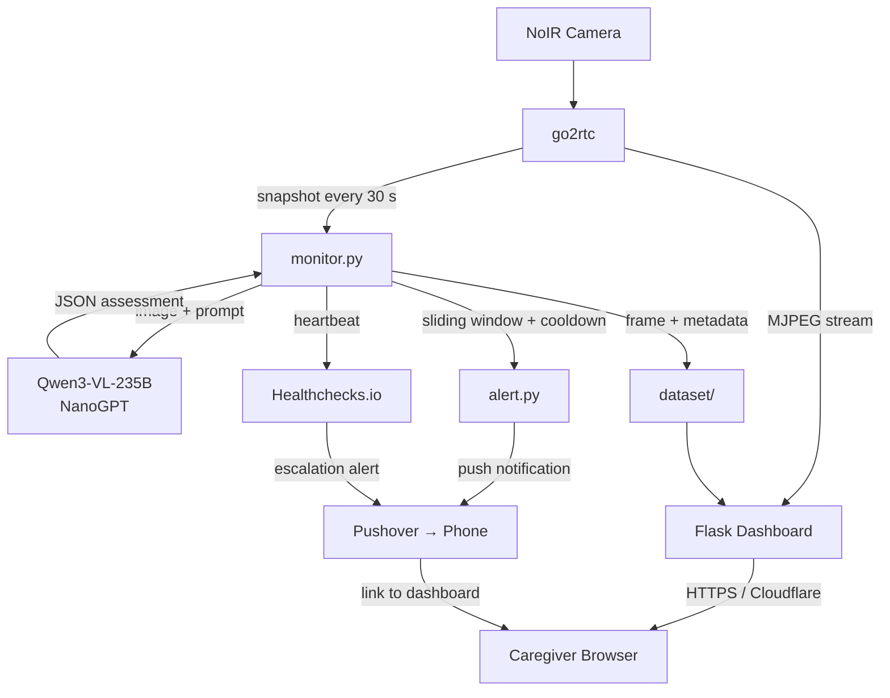

# Vigil

> Passive AI monitoring for the people who need it most.

<p align="center"></p>


---

## The Problem

A 97-year-old woman with Parkinson's disease is bed-bound and largely non-verbal. She cannot press a call button, cannot ask for help, and regularly gets into dangerous positions she cannot escape from — wedged against bed rails, partially off the mattress, or in postures that cut off circulation.

Her daughter is the full-time live-in caregiver. This means constant vigilance: checking every few minutes, interrupted sleep, and the compounding exhaustion of not being able to look away for long. The builder is a paramedic and developer who lives remotely and cannot be physically present.

**Vigil is the solution.** A passive AI monitoring system that watches 24/7, alerts the caregiver when something looks wrong, and lets her check in from any room — or any location — without any specialized hardware or technical knowledge.

---

## How It Works

Every 30 seconds, the system captures a frame from a ceiling-mounted NoIR camera and sends it to a vision language model (Qwen3 VL 235B A22B Instruct via NanoGPT). The model assesses whether the patient appears safe, returning a structured JSON verdict: safe/unsafe, confidence level, and a brief reasoning string.

The alert engine applies a sliding window and cooldown logic to suppress noise before deciding whether to send a push notification to the caregiver's phone. False positives are logged and can be labeled from the dashboard.



---

## Features

### AI Safety Assessment
- Vision language model evaluates every frame for patient safety
- Structured JSON output: `safe`, `confidence` (high/medium/low), `reason`
- Fail-safe: malformed or missing responses default to "safe/low" — never false alarms from API errors

### Smart Alert Logic
- **Sliding window** — requires N unsafe verdicts in the last 5 before alerting, tunable per confidence level
- **Cooldown** — suppresses repeat alerts for a configurable window (default: 5 min for high confidence, 60 min for low)
- **Patient location state machine** — auto-silences alerts when the patient is confirmed out of bed (being cared for) and auto-resumes when she returns

### Pushover Notifications
- Instant push to caregiver's phone with a direct link to the relevant gallery frame
- Emergency priority (Pushover p2) for high-confidence unsafe assessments
- Builder receives a separate low-priority copy of all alerts

### Live Video Dashboard
- MJPEG live stream proxied through Flask, accessible from any phone browser
- Served over HTTPS via Cloudflare Tunnel — no port forwarding, no dynamic DNS
- Auto-reconnects on stream drop with exponential backoff; periodic forced refresh to catch silent stalls

### Gallery and Labeling
- Last 50 frames shown with AI verdict, confidence, reason, and timestamp
- Tap any frame to view full-size and label it (Real Issue / False Alarm)
- Labels write back to `log.jsonl` for future fine-tuning

### Two-Way Audio
- Browser mic → Pi speaker and Pi mic → browser speaker via WebRTC (go2rtc)
- Caregiver can speak to the patient directly from the dashboard
- Requires Tailscale (WebRTC UDP cannot traverse Cloudflare's HTTP-only tunnel)

### Alert Silence
- One-tap 30-minute silence from the dashboard
- Caregiver activates when she's already in the room
- Auto-resumes; silence state visible in dashboard header

### Caregiver Check-In Logging
- Dashboard open events (`stream_opened`, `gallery_opened`) logged to `checkins.jsonl`
- Missed-alert self-reports appended by caregiver button press
- Provides an audit trail for care review

### Dead Man's Switch (Healthchecks.io)
- App-level heartbeat pinged after every successful monitoring cycle
- OS-level cron heartbeat every 5 minutes for independent confirmation
- If pings stop for a configurable duration, escalation alert fires to the caregiver

### Dataset Collection
- Every alert-triggering frame saved automatically
- Normal frames sampled every 5 minutes
- `log.jsonl` schema records timestamp, frame path, assessment, alert decision, and labels
- Designed for future fine-tuning of a smaller on-device model

---

## Hardware

| Component | Part | Notes |
|---|---|---|
| SBC | Raspberry Pi 5 (4GB or 8GB) | ARM64, runs headless |
| Camera | Arducam IMX708 NoIR | CSI ribbon cable, night vision |
| IR Illumination | Arducam IR LED board or equivalent | For low-light coverage |
| Audio input | USB mic via UGREEN USB-C audio adapter | `plughw:CARD=Device,DEV=0` |
| Audio output | Logitech S150 USB speaker | `plughw:CARD=S150,DEV=0` |
| Storage | 64GB+ microSD (A2/UHS-I) | Stores video dataset locally |
| UPS | CyberPower CP425G or APC BE600M1 | Prevents data corruption on power loss |

<!-- HARDWARE_PHOTO:  -->

---

## Tech Stack

| Layer | Technology |
|---|---|
| Camera streaming | [go2rtc](https://github.com/AlexxIT/go2rtc) — owns the CSI camera exclusively |
| Vision AI | [Qwen3 VL 235B A22B Instruct](https://nano-gpt.com) via NanoGPT |
| Alerts | [Pushover](https://pushover.net) |
| Web dashboard | Python / Flask |
| Remote access | [Cloudflare Tunnel](https://developers.cloudflare.com/cloudflare-one/connections/connect-networks/) |
| Remote audio | [Tailscale](https://tailscale.com) (WebRTC requires UDP) |
| Monitoring | [Healthchecks.io](https://healthchecks.io) dead man's switch |
| Python deps | `flask`, `requests`, `pyyaml`, `pillow` |

---

## Project Structure

```
vigil/
  monitor.py          # Main loop: capture → assess → alert → log
  web_server.py       # Flask dashboard and all HTTP routes
  alert.py            # Sliding window, cooldown, Pushover channel
  healthchecks.py     # Dead man's switch pinger and escalation logic
  prompt_builder.py   # Builds the VLM prompt from config + sensor data
  vlm_parser.py       # Parses raw VLM JSON → AssessmentResult (fail-safe)
  nanogpt_provider.py      # NanoGPT VLM adapter
  config.py           # Typed configuration dataclasses
  config.yaml         # All settings and secrets (gitignored)
  go2rtc.yaml         # Camera and streaming configuration
  setup/              # Install scripts and systemd service files
  templates/          # Dashboard HTML
  static/             # Dashboard JS and CSS
  dataset/            # Saved frames and JSONL log
  docs/               # Install guide, Mom's user guide, sensor setup
  tests/              # Full unit and integration test suite
```

---

## Getting Started

1. **Flash Raspberry Pi OS Lite 64-bit** on a Pi 5 using Raspberry Pi Imager
2. **SSH in**, clone this repo, and populate `config.yaml` (see `config.py` for the full schema)
3. **Run `setup/install.sh`** — installs go2rtc, creates systemd services, sets up cron heartbeat
4. **Set up Cloudflare Tunnel** via `setup/cloudflare_setup.sh` for remote HTTPS access
5. **Set up Tailscale** via `setup/tailscale_setup.sh` for two-way audio

See [`docs/INSTALL_GUIDE.md`](docs/INSTALL_GUIDE.md) for the full step-by-step walkthrough.

### Minimum `config.yaml`

```yaml
api:
  provider: nanogpt
  model: qwen3-vl-235b-a22b
  nanogpt_api_key: "sk-..."

monitor:
  interval_seconds: 30
  image_width: 960
  image_height: 540

alerts:
  pushover_api_key: "..."
  pushover_user_key: "..."
```

---

## Screenshots

<!-- SCREENSHOT_DASHBOARD:  -->
<!-- SCREENSHOT_ALERT:  -->
<!-- SCREENSHOT_GALLERY:  -->

---

## Design Decisions

**Why a ceiling camera and not a wearable?**
A wearable requires patient cooperation. This patient cannot cooperate.

**Why MJPEG + Flask and not a dedicated video platform?**
Everything needs to work through a single HTTPS URL that Mom can bookmark on her phone. Cloudflare Tunnel provides that without any router configuration. WebRTC is used only for audio because it requires UDP, which Cloudflare's HTTP-only tunnel cannot forward.

**Why a VLM instead of a fine-tuned pose model?**
VLMs reason about context — they understand "wedged against the rail" in a way a pose skeleton cannot. Fine-tuned models are the long-term target; the VLM serves as the labeling engine to build the training set.

**Why Pushover and not SMS or email?**
Pushover supports priority levels, including p2 emergency (rings repeatedly until acknowledged). That's a feature SMS and email can't match for a safety-critical alert system.

**Why a sliding window instead of single-frame alerts?**
Parkinson's tremors and repositioning movements look alarming in a single frame. Requiring N-of-5 unsafe verdicts before alerting dramatically reduces false positives without meaningfully delaying real alerts.

---

## A Note on Privacy

All video footage stays on the local device. Frames are sent to the NanoGPT API for analysis but are never stored by this application on any external server. Push notifications contain a dashboard link only — no images are ever embedded in or attached to notifications.

The dataset (`dataset/images/`, `dataset/log.jsonl`) is stored locally on the Pi and never synced to any cloud service by default.

---

*Built with care for a 97-year-old who deserves to sleep safely.*
